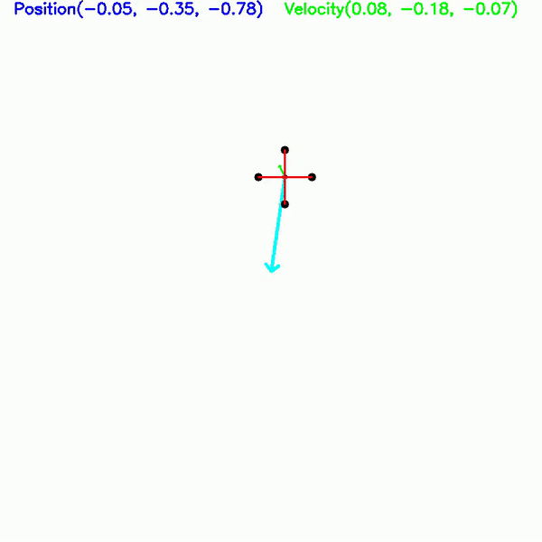
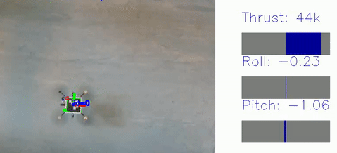

# eagerx_sideproject
## Dependencies

Ros Noetic\
[eagerx](https://eagerx.readthedocs.io/en/master/index.html)\
[Interface for eagerx crazyflie](https://github.com/runyuma/cf_eagerx)

## Traning for Crazyflie
1. train without velocity
```
python crazyfly_main.py
```
2. train with velocity
```
python crazyfly_vel.py
```
## Testing for Crazyflie
```
roslaunch cf_eagerx cf.launch
python cf_real(_vel).py
```
# Sim2World Transfer 
## Simulation result

## Real world result

